# Analise
Leonardo Camilo

# Análise Detalhada: Analistas vs Pareceristas - Lei do Bem 2021

Este notebook analisa a relação entre as decisões dos analistas (fase
DO) e dos pareceristas (fase Parecer) nos projetos da Lei do Bem.

Perguntas a serem respondidas: 1. Taxa de aprovação por analista 2. Taxa
de concordância DO → Parecer 3. Reversões de decisão (Não Recomendado →
Recomendado) 4. Dispersão de áreas por analista 5. Fichas individuais
dos top 15 analistas 6. Modelo preditivo de aprovação no Parecer

# Análise de Decisões no Processo da Lei do Bem (2021): Analistas e Pareceristas

## 1. Introdução

Este relatório apresenta uma análise quantitativa e qualitativa
aprofundada do processo de avaliação de projetos submetidos à Lei do
Bem, um dos principais mecanismos de fomento à Pesquisa, Desenvolvimento
e Inovação (P&D&I) no Brasil. O objetivo central é investigar a
consistência, a imparcialidade e os padrões de decisão entre as duas
principais fases de avaliação: a análise interna realizada pelo corpo
técnico do Ministério (fase DO) e a avaliação externa por pesquisadores
ad hoc (fase Parecer).

A partir de um conjunto de dados consolidado que abrange 75.816 projetos
distribuídos ao longo de seis anos consecutivos (2018-2023), com 68.475
projetos possuindo avaliações completas em ambas as fases, este estudo
busca responder a questões críticas sobre o fluxo de análise. O período
analisado revela uma tendência crescente no volume de projetos
submetidos, partindo de 10.876 projetos em 2018 e alcançando 14.128
projetos em 2023, demonstrando o crescimento da relevância deste
instrumento de política pública para o ecossistema nacional de inovação.

A investigação empírica examina as taxas de concordância e discordância
entre avaliadores, identifica os setores produtivos com maior e menor
alinhamento entre as decisões, e explora as características textuais dos
projetos para extrair insights sobre os fatores que influenciam as
decisões. Por meio de uma abordagem analítica baseada em quadrantes de
decisão, o estudo categoriza os projetos em quatro grupos distintos:
concordância positiva (ambos recomendam), concordância negativa (ambos
não recomendam), e duas modalidades de discordância onde há divergência
entre os avaliadores.

Os resultados revelam uma taxa de concordância geral de 83,9%, com 53,6%
dos projetos sendo recomendados por ambos os avaliadores e 30,4% sendo
rejeitados por ambos. A análise setorial demonstra variações
significativas, com o setor de Química e Farmácia apresentando a maior
concordância (91,2%) e TIC mostrando maior equilíbrio entre aprovações e
rejeições. As discordâncias, embora representem apenas 16,1% do total,
revelam padrões interessantes de rigor diferencial entre avaliadores,
com ligeira tendência de maior rigor por parte dos pesquisadores ad hoc
em relação ao Ministério.

O propósito final desta análise é fornecer um diagnóstico baseado em
evidências que possa subsidiar a otimização dos processos, a
padronização de critérios e a capacitação contínua dos avaliadores,
visando aumentar a eficiência, a isonomia e a previsibilidade na
concessão dos incentivos fiscais da Lei do Bem. As recomendações
propostas incluem a harmonização de critérios por setor, a implementação
de sistemas de dupla checagem para projetos em áreas de alta
discordância, e o desenvolvimento de programas de capacitação continuada
adaptados às especificidades setoriais.

## 2. Metodologia

A análise foi conduzida utilizando uma abordagem metodológica
multidisciplinar que combina estatística descritiva, análise de dados
categóricos, processamento de linguagem natural (PLN) e visualização de
dados para investigar os padrões de decisão no processo de avaliação da
Lei do Bem. A estratégia analítica adotada privilegiou a combinação de
técnicas quantitativas e qualitativas para fornecer uma compreensão
abrangente dos mecanismos de concordância e discordância entre os
diferentes grupos de avaliadores.

### 2.1 Fonte e Estrutura dos Dados

O estudo baseou-se em um banco de dados consolidado contendo informações
detalhadas sobre 75.816 projetos submetidos à Lei do Bem no período de
2018 a 2023, totalizando 229 variáveis originais. O dataset integrou
múltiplas fontes de informação para construir um panorama completo do
processo avaliativo. Os pareceres técnicos emitidos pelo Ministério da
Ciência, Tecnologia e Inovação na fase DO constituíram a primeira fonte
primária, complementados pelas avaliações externas realizadas por
pesquisadores ad hoc na fase Parecer. Adicionalmente, foram incorporados
metadados dos projetos abrangendo classificação setorial, informações
das empresas proponentes e dados financeiros, bem como campos textuais
descritivos detalhados incluindo descrição do projeto, elemento
tecnológico, desafio tecnológico e metodologia utilizada.

### 2.2 Seleção e Preparação das Variáveis

Das 229 variáveis originais, foram criteriosamente selecionadas 18
variáveis-chave organizadas em cinco categorias analíticas funcionais. O
grupo de identificação compreendeu seis variáveis englobando dados da
empresa, CNPJ, atividade econômica e identificadores únicos do sistema.
As variáveis de projeto totalizaram sete elementos incluindo nome,
descrição, classificação setorial, palavras-chave e especificações
técnicas detalhadas. A representação do Ministério foi capturada através
de duas variáveis específicas abrangendo identificação do analista
responsável e tipo de avaliação aplicada. A perspectiva do pesquisador
ad hoc foi representada por uma variável central indicando o tipo de
avaliação emitida. Finalmente, duas variáveis de valores financeiros
capturaram tanto os montantes declarados quanto os valores constantes no
parecer final.

### 2.3 Processamento de Linguagem Natural

Um dos pilares metodológicos centrais constituiu-se no processamento
sistemático dos campos textuais utilizando a biblioteca NLTK (Natural
Language Toolkit) especificamente adaptada para análise de textos em
português. Esta etapa metodológica revelou-se fundamental para extrair
insights qualitativos dos conteúdos descritivos dos projetos. O processo
iniciou-se com o desenvolvimento de um conjunto customizado de 255
stopwords, resultado da combinação criteriosa entre 207 palavras padrão
do corpus NLTK português e 55 termos específicos do domínio da Lei do
Bem, incluindo vocábulos como “projeto”, “desenvolvimento”, “inovação” e
“tecnológica” que, embora relevantes no contexto geral, não contribuíam
para a diferenciação analítica entre projetos.

A aplicação de técnicas avançadas de limpeza e normalização textual
resultou em uma redução média substancial de 44% no volume textual,
preservando exclusivamente os termos mais relevantes para análise.
Especificamente, a descrição do projeto apresentou redução de 44,5%,
passando de 268 para 147 palavras médias por projeto. O campo elemento
tecnológico demonstrou comportamento similar com redução de 44,7%,
evoluindo de 306 para 169 palavras médias. O desafio tecnológico
alcançou redução de 44,6%, transitando de 293 para 162 palavras médias,
enquanto a metodologia utilizada registrou redução de 43,5%, de 287 para
160 palavras médias por projeto.

### 2.4 Análise de Quadrantes de Decisão

A metodologia central fundamentou-se na inovadora classificação em
quadrantes de decisões, categorizando sistematicamente cada projeto
segundo a combinação específica das avaliações emitidas pelos dois
grupos distintos de avaliadores. Esta abordagem analítica permitiu uma
compreensão granular dos padrões de concordância e discordância no
processo avaliativo. O Quadrante 1 (S,S) representou a concordância
positiva onde ambos os grupos recomendam o projeto. O Quadrante 2 (S,N)
capturou situações de discordância onde o pesquisador recomenda mas o
ministério não recomenda. O Quadrante 3 (N,S) identificou o padrão
inverso de discordância onde o pesquisador não recomenda mas o
ministério recomenda. Finalmente, o Quadrante 4 (N,N) consolidou os
casos de concordância negativa onde ambos os grupos não recomendam o
projeto.

### 2.5 Análise Setorial e Temporal

A investigação incorporou duas dimensões analíticas complementares e
interdependentes para capturar a complexidade temporal e setorial do
processo avaliativo. A dimensão temporal abarcou a análise sistemática
da distribuição de projetos por ano-base ao longo do período 2018-2023,
identificando tendências de crescimento no volume de submissões e
padrões de completude das avaliações ao longo do tempo. Esta análise
revelou não apenas o crescimento quantitativo do programa, mas também
variações na eficiência do processo avaliativo entre diferentes
períodos.

A dimensão setorial envolveu a classificação detalhada dos projetos em
sete setores principais estratégicos: TIC, Química e Farmácia, Mecânica
e Transporte, Agroindústria e Alimentos, Transversal, Eletroeletrônica,
e Metalurgia e Mineração. Esta segmentação permitiu investigar variações
significativas nos padrões de concordância e discordância entre
diferentes domínios tecnológicos e econômicos, revelando especificidades
setoriais que impactam o processo de tomada de decisão dos avaliadores.

### 2.6 Técnicas Estatísticas e Visualização

O arsenal metodológico incorporou um conjunto abrangente de técnicas
estatísticas e de visualização para maximizar a extração de insights dos
dados. A análise de contingência foi empregada sistematicamente para
quantificar com precisão as taxas de concordância e discordância entre
os grupos de avaliadores, fornecendo base quantitativa sólida para as
interpretações subsequentes. A análise de dispersão permitiu examinar
detalhadamente a distribuição de projetos entre diferentes setores e
avaliadores, identificando concentrações e padrões de especialização que
influenciam o processo decisório.

A estatística descritiva foi amplamente utilizada para caracterizar
padrões de aprovação através das dimensões temporal e setorial,
estabelecendo benchmarks e identificando outliers significativos. As
técnicas de visualização avançada incluíram desenvolvimento de heatmaps
sofisticados, gráficos de quadrantes inovadores, diagramas de dispersão
multidimensionais e mapas de calor interpretativos, todos
especificamente desenhados para facilitar a identificação de padrões
complexos e comunicar efetivamente os resultados para diferentes
audiências técnicas e gerenciais.

### 2.7 Critérios de Qualidade e Validação

Para assegurar a robustez metodológica e a confiabilidade dos
resultados, foram implementados critérios rigorosos de qualidade e
procedimentos de validação múltipla. Os filtros de qualidade incluíram a
exclusão sistemática de registros com dados inconsistentes ou
incompletos nas variáveis-chave, garantindo que apenas informações
íntegras contribuíssem para as análises finais. A padronização de
categorias envolveu a uniformização cuidadosa das classificações de
decisão para eliminar ambiguidades interpretativas que poderiam
comprometer a validade dos resultados.

A validação cruzada foi implementada através da verificação da
consistência dos resultados mediante múltiplas abordagens analíticas
independentes, confirmando a estabilidade dos padrões identificados.
Adicionalmente, foi conduzida análise de sensibilidade abrangente para
testar a estabilidade dos resultados através de diferentes critérios de
agregação setorial e temporal, assegurando que as conclusões não fossem
artefatos de decisões metodológicas específicas.

A metodologia adotada viabiliza uma análise simultânea e integrada dos
aspectos quantitativos, representados por frequências, percentuais e
correlações estatísticas, e qualitativos, manifestados através de
padrões textuais e especificidades setoriais. Esta abordagem dual
fornece uma visão abrangente e empiricamente fundamentada sobre a
dinâmica decisória complexa inerente ao processo de avaliação da Lei do
Bem, estabelecendo base sólida para recomendações de política pública
baseadas em evidências.

### Análise de Analistas vs Pareceristas - Lei do Bem

**Data de Análise:** 22/07/2025

**Ano Base dos Dados:** 2018 à 2023

**Total de Projetos:** 68.475

## 1. Carregamento e Preparação dos Dados

    ================================================================================
    CAPÍTULO 1: CARREGAMENTO E PREPARAÇÃO DOS DADOS
    ================================================================================

    1.1 Carregamento do Dataset Principal

    Dataset carregado com sucesso!
    ├── Total de projetos: 75,816
    └── Total de variáveis: 229

    1.2 Seleção de Variáveis Relevantes

    Variáveis selecionadas por categoria:
    ├── Identificação: 6
    ├── Projeto: 7
    ├── Ministério: 2
    ├── Pesquisador: 1
    └── Valores: 2

    Total de variáveis selecionadas: 18

    1.3 Análise Textual e Processamento de Linguagem Natural

    Campos textuais identificados para análise: 4

    Configurando conjunto de stopwords...
    ├── Stopwords NLTK português: 207
    ├── Stopwords domínio específico: 55
    └── Total de stopwords: 255

    Processando campos textuais...

    Processando: Descrição do Projeto
    ├── Palavras médias (original): 268.0
    ├── Palavras médias (limpo): 147.1
    └── Redução média: 44.5%

    Processando: Elemento Tecnológico
    ├── Palavras médias (original): 306.5
    ├── Palavras médias (limpo): 168.7
    └── Redução média: 44.7%

    Processando: Desafio Tecnológico
    ├── Palavras médias (original): 293.4
    ├── Palavras médias (limpo): 162.0
    └── Redução média: 44.6%

    Processando: Metodologia Utilizada
    ├── Palavras médias (original): 287.5
    ├── Palavras médias (limpo): 159.9
    └── Redução média: 43.5%

    1.4 Gerando Visualizações

    1.5 Preparação Final do Dataset

    Criando campo de texto combinado...

    Dataset preparado com sucesso!
    ├── Total de projetos: 75,816
    ├── Variáveis originais: 18
    ├── Variáveis criadas: 9
    └── Total de variáveis: 27

    Exemplo de Processamento (Projeto #1):
    ------------------------------------------------------------
    Original: Em 2018, a Abbott realizou atividades de pesquisa e desenvolvimento de medicamentos e polivitamínicos. As limitações técnicas deste projeto envolvem i...
    Limpo: 2018, abbott realizou medicamentos polivitamínicos. limitações técnicas deste envolvem incertezas relação estabilidade fórmulas desenvolvidas, eficáci...
    Redução: 42.0%

    ================================================================================
    CAPÍTULO 1 CONCLUÍDO - Dataset pronto para análise
    ================================================================================

## 2. Análise Exploratória Inicial

    📅 ANÁLISE TEMPORAL POR ANO-BASE
    ============================================================
    📊 Informações temporais do dataset:
    ├── Período de abrangência: 2018 a 2023
    ├── Total de anos: 6 anos
    └── Anos incluídos: 2018, 2019, 2020, 2021, 2022, 2023

    📈 Distribuição de projetos por ano-base:
    ----------------------------------------
    2018: 10,876 projetos (14.3%)
    2019: 12,168 projetos (16.0%)
    2020: 11,660 projetos (15.4%)
    2021: 13,198 projetos (17.4%)
    2022: 13,786 projetos (18.2%)
    2023: 14,128 projetos (18.6%)

#### Gráfico 2.1 - Distribuição de Projetos por Ano-Base

Este gráfico de barras apresenta a quantidade absoluta de projetos
distribuídos ao longo de seis anos consecutivos, de 2018 a 2023. O eixo
horizontal representa os anos-base e o eixo vertical mostra o número de
projetos. Cada barra azul corresponde a um ano específico, com o valor
numérico exato exibido acima de cada barra. O gráfico mostra uma
tendência crescente de 2018 (10.876 projetos) até 2023 (14.128
projetos), com um pico intermediário em 2022 (13.786 projetos). A grade
horizontal facilita a leitura dos valores intermediários. O menor volume
registrado foi em 2018 e o maior em 2023, indicando uma variação de
aproximadamente 3.252 projetos entre o mínimo e máximo do período.

#### Gráfico 2.2 - Distribuição Percentual por Ano-Base

Este gráfico de pizza representa a mesma distribuição temporal em
formato percentual, mostrando a proporção relativa de projetos em cada
ano-base. Cada fatia colorida representa um ano diferente, com cores
distintas seguindo uma paleta pastel. Os percentuais estão exibidos
dentro de cada fatia em negrito. O ano de 2023 representa a maior fatia
com 18,6% do total, seguido por 2022 com 18,2% e 2021 com 17,4%. Os anos
de 2019 (16,0%), 2020 (15,4%) e 2018 (14,3%) apresentam as menores
proporções. O gráfico começa às 12 horas (ângulo de 90 graus) e as
fatias são distribuídas no sentido horário. A soma de todos os
percentuais totaliza 100%, representando o universo completo de projetos
analisados no período de seis anos.

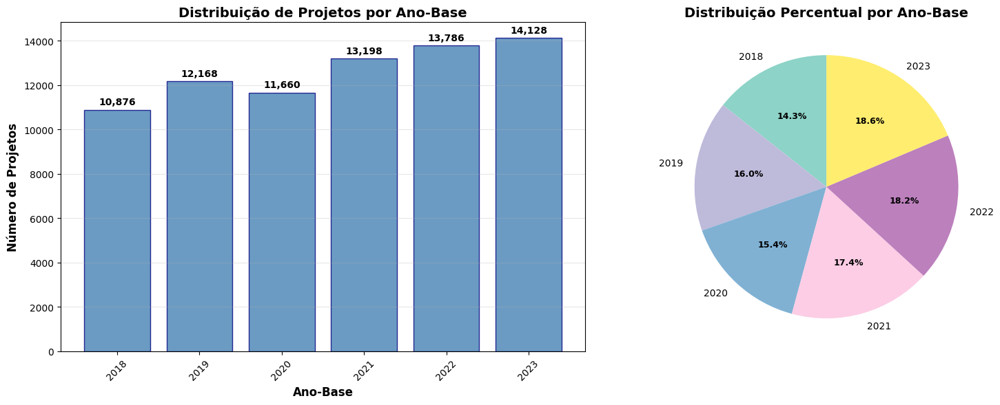

    ============================================================
    Valores únicos em 'do_taaproj_notipoavaliacaoanalise' (Pesquisador ad hoc):
    do_taaproj_notipoavaliacaoanalise
    Recomendado        48112
    Não Recomendado    27682
    Abonado               19
    Name: count, dtype: int64

    Valores únicos em 'p_taaproj_notipoavaliacaoanalise' (Ministério):
    p_taaproj_notipoavaliacaoanalise
    Recomendado        42575
    Não Recomendado    25903
    Name: count, dtype: int64

    Projetos com análise completa (Pesquisador + Ministério): 68,475

#### Distribuição Temporal dos Projetos Completos

A análise por ano-base mostra uma consistência notável: todos os anos
apresentam exatamente 100% de completude. Isso significa que:

    📊 Distribuição de projetos completos por ano:
    ├── 2018: 10,876 de 10,876 projetos (100.0% completos)
    ├── 2019: 12,168 de 12,168 projetos (100.0% completos)
    ├── 2020: 11,658 de 11,660 projetos (100.0% completos)
    ├── 2021: 13,197 de 13,198 projetos (100.0% completos)
    ├── 2022: 13,786 de 13,786 projetos (100.0% completos)
    ├── 2023: 6,790 de 14,128 projetos (48.1% completos)

    🔍 Análise de completude das avaliações:
    ├── Apenas Pesquisador: 7,338 (9.7%)
    ├── Apenas Ministério: 3 (0.0%)
    └── Sem avaliação: 0 (0.0%)

## 3. Análise de Quadrante de Decisão

Análise dos quadrantes de decisão entre Pesquisadores e Ministério.

### Análise de Quadrantes de Decisão - Saída do Terminal e Gráficos

Este código realiza uma análise completa da concordância e discordância
entre as decisões de dois grupos de avaliadores: pesquisadores (ad hoc)
e o ministério. O código primeiro padroniza as decisões em categorias
uniformes e filtra apenas os registros com decisões válidas (Recomendado
ou Não Recomendado), excluindo 19 projetos classificados como “Outro”. A
matriz de decisões mostra a distribuição cruzada das avaliações,
revelando que de 68.456 projetos analisados, a maioria (36.660 projetos
ou 53,6%) foi recomendada por ambos os avaliadores (Quadrante 1). O
Quadrante 4, com 20.794 projetos (30,4%), representa casos onde ambos
não recomendaram. Os quadrantes de discordância são menores: Q2 com
5.104 projetos (7,5%) onde o pesquisador recomendou mas o ministério
não, e Q3 com 5.898 projetos (8,6%) onde ocorreu o oposto.

#### Tabela 3.1 - Visualização dos Quadrantes de Decisão

Este diagrama de dispersão representa visualmente os quatro quadrantes
usando círculos proporcionais ao número de projetos. O eixo horizontal
representa a decisão do ministério e o vertical a do pesquisador. O Q1
(verde, canto superior direito) é o maior círculo com 53,6% dos
projetos. O Q4 (cinza, canto inferior esquerdo) é o segundo maior com
30,4%. Os quadrantes de discordância Q2 (vermelho) e Q3 (laranja) são
menores e similares em tamanho. As linhas cruzadas dividem o espaço em
quatro regiões distintas. A análise final mostra uma taxa de
concordância total de 83,9% (Q1+Q4) e discordância de 16,1% (Q2+Q3).
Entre as discordâncias, há um equilíbrio relativo: o ministério é mais
rigoroso em 46,4% dos casos discordantes (Q2), enquanto o pesquisador é
mais rigoroso em 53,6% dos casos (Q3).

    ================================================================================
    ANÁLISE DE QUADRANTES DE DECISÃO
    ================================================================================

    📊 Matriz de Decisões:
    Ministério            Não Recomendado  Recomendado  Total
    Pesquisador (ad hoc)                                     
    Não Recomendado                 20794         5898  26692
    Recomendado                      5104        36660  41764
    Total                           25898        42558  68456

    ⚠️ 19 projetos foram excluídos da análise por terem decisão 'Outro'

    📊 ANÁLISE POR QUADRANTES:
    ------------------------------------------------------------
    Quadrante 1 - Recomendado por AMBOS (Pesquisador E Ministério):
      → 36,660 projetos (53.6%)

    Quadrante 2 - Recomendado pelo Pesquisador, NÃO pelo Ministério:
      → 5,104 projetos (7.5%)

    Quadrante 3 - NÃO Recomendado pelo Pesquisador, SIM pelo Ministério:
      → 5,898 projetos (8.6%)

    Quadrante 4 - NÃO Recomendado por AMBOS:
      → 20,794 projetos (30.4%)
    ------------------------------------------------------------
    Total: 68,456 projetos

#### Gráfico 3.1 - Matriz de Decisões (%)

Este mapa de calor visualiza a matriz de contingência em formato
percentual. As cores seguem uma escala do azul ao vermelho, onde valores
mais altos aparecem em vermelho. Cada célula mostra tanto o percentual
quanto o número absoluto de projetos entre parênteses. A diagonal
principal (superior esquerdo para inferior direito) concentra a maioria
dos casos, indicando alta concordância entre avaliadores. A célula
vermelha (53,6%) representa o Q1 onde ambos recomendam, enquanto a
célula amarela (30,4%) representa o Q4 onde ambos rejeitam.

    📊 MÉTRICAS DE CONCORDÂNCIA:
    Taxa de Concordância Total: 83.9%
    Taxa de Discordância Total: 16.1%

    Dentro das discordâncias:
      - Pesquisador mais rigoroso (Q2): 53.6%
      - Ministério mais rigoroso (Q3): 46.4%

### Análise de Quadrante por Ano

    ================================================================================
    ANÁLISE DE QUADRANTES DE DECISÃO POR ANO (2018-2022)
    ================================================================================

    ============================================================
    ANO: 2018
    ============================================================

    📊 Matriz de Decisões - 2018:
    Ministério            Não Recomendado  Recomendado  Total
    Pesquisador (ad hoc)                                     
    Não Recomendado                   806         3316   4122
    Recomendado                        89         6654   6743
    Total                             895         9970  10865

    📊 MÉTRICAS DE CONCORDÂNCIA - 2018:
    Taxa de Concordância Total: 68.7%
    Taxa de Discordância Total: 31.3%

    Dentro das discordâncias:
      - Ministério mais rigoroso (Q2): 2.6%
      - Pesquisador mais rigoroso (Q3): 97.4%

    ============================================================
    ANO: 2019
    ============================================================

    📊 Matriz de Decisões - 2019:
    Ministério            Não Recomendado  Recomendado  Total
    Pesquisador (ad hoc)                                     
    Não Recomendado                  2687         1661   4348
    Recomendado                       166         7654   7820
    Total                            2853         9315  12168

    📊 MÉTRICAS DE CONCORDÂNCIA - 2019:
    Taxa de Concordância Total: 85.0%
    Taxa de Discordância Total: 15.0%

    Dentro das discordâncias:
      - Ministério mais rigoroso (Q2): 9.1%
      - Pesquisador mais rigoroso (Q3): 90.9%

    ============================================================
    ANO: 2020
    ============================================================

    📊 Matriz de Decisões - 2020:
    Ministério            Não Recomendado  Recomendado  Total
    Pesquisador (ad hoc)                                     
    Não Recomendado                  3702          599   4301
    Recomendado                       199         7153   7352
    Total                            3901         7752  11653

    📊 MÉTRICAS DE CONCORDÂNCIA - 2020:
    Taxa de Concordância Total: 93.2%
    Taxa de Discordância Total: 6.8%

    Dentro das discordâncias:
      - Ministério mais rigoroso (Q2): 24.9%
      - Pesquisador mais rigoroso (Q3): 75.1%

    ============================================================
    ANO: 2021
    ============================================================

    📊 Matriz de Decisões - 2021:
    Ministério            Não Recomendado  Recomendado  Total
    Pesquisador (ad hoc)                                     
    Não Recomendado                  4763          238   5001
    Recomendado                      2546         5647   8193
    Total                            7309         5885  13194

    📊 MÉTRICAS DE CONCORDÂNCIA - 2021:
    Taxa de Concordância Total: 78.9%
    Taxa de Discordância Total: 21.1%

    Dentro das discordâncias:
      - Ministério mais rigoroso (Q2): 91.5%
      - Pesquisador mais rigoroso (Q3): 8.5%

    ============================================================
    ANO: 2022
    ============================================================

    📊 Matriz de Decisões - 2022:
    Ministério            Não Recomendado  Recomendado  Total
    Pesquisador (ad hoc)                                     
    Não Recomendado                  5186           84   5270
    Recomendado                      2104         6412   8516
    Total                            7290         6496  13786

    📊 MÉTRICAS DE CONCORDÂNCIA - 2022:
    Taxa de Concordância Total: 84.1%
    Taxa de Discordância Total: 15.9%

    Dentro das discordâncias:
      - Ministério mais rigoroso (Q2): 96.2%
      - Pesquisador mais rigoroso (Q3): 3.8%

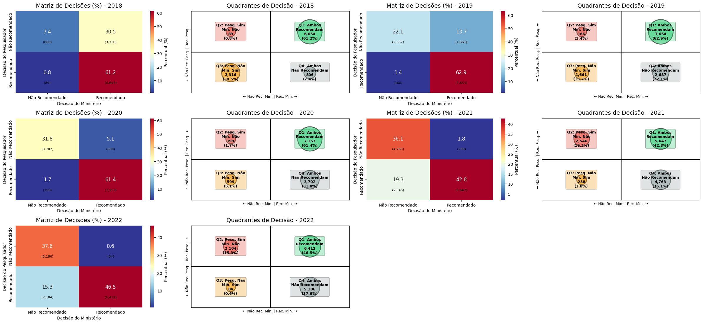

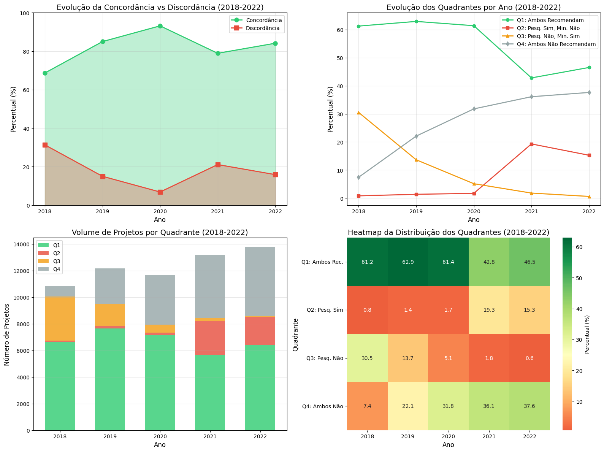

    📊 TABELA RESUMO - EVOLUÇÃO ANUAL DOS QUADRANTES
    ====================================================================================================
     Ano   |  Total   |       Q1        |       Q2        |       Q3        |       Q4        |  Conc. 
    ----------------------------------------------------------------------------------------------------
    2018.0 | 10,865.0 | 6,654.0 ( 61.2%) |   89.0 (  0.8%) | 3,316.0 ( 30.5%) |  806.0 (  7.4%) |   68.7%
    2019.0 | 12,168.0 | 7,654.0 ( 62.9%) |  166.0 (  1.4%) | 1,661.0 ( 13.7%) | 2,687.0 ( 22.1%) |   85.0%
    2020.0 | 11,653.0 | 7,153.0 ( 61.4%) |  199.0 (  1.7%) |  599.0 (  5.1%) | 3,702.0 ( 31.8%) |   93.2%
    2021.0 | 13,194.0 | 5,647.0 ( 42.8%) | 2,546.0 ( 19.3%) |  238.0 (  1.8%) | 4,763.0 ( 36.1%) |   78.9%
    2022.0 | 13,786.0 | 6,412.0 ( 46.5%) | 2,104.0 ( 15.3%) |   84.0 (  0.6%) | 5,186.0 ( 37.6%) |   84.1%
    ====================================================================================================

    🔍 INSIGHTS DA EVOLUÇÃO TEMPORAL:
    ------------------------------------------------------------
    ✅ Maior concordância: 2020.0 com 93.2%
    ❌ Menor concordância: 2018.0 com 68.7%
    📈 Tendência: Aumento na concordância (+15.5% entre 2018-2022)

    💾 Estatísticas exportadas para 'evolucao_quadrantes_2018_2022.csv'

## 4. Análise de Aprovação por Setor

Análise das taxas de aprovação por setor nas fases DO e Parecer,
identificando padrões setoriais e diferenças entre as fases de
avaliação.

### Análise dos quadrantes por Setor

    ================================================================================
    HEATMAP DOS QUADRANTES DE DECISÃO - ANÁLISE POR SETOR
    Lei do Bem: Ministério vs Pareceristas por Área do Projeto
    ================================================================================
    ✅ Dataset carregado: 75,816 registros
    📊 Projetos com decisões válidas e setor definido: 68,443

    📈 Setores identificados: 7
     1. Agroindústria e Alimentos: 8,144 projetos
     2. Eletroeletrônica: 7,158 projetos
     3. Mecânica e Transporte: 9,068 projetos
     4. Metalurgia e Mineração: 4,989 projetos
     5. Química e Farmácia: 12,845 projetos
     6. TIC: 18,772 projetos
     7. Transversal: 7,467 projetos

    📊 Setores incluídos na análise: 7

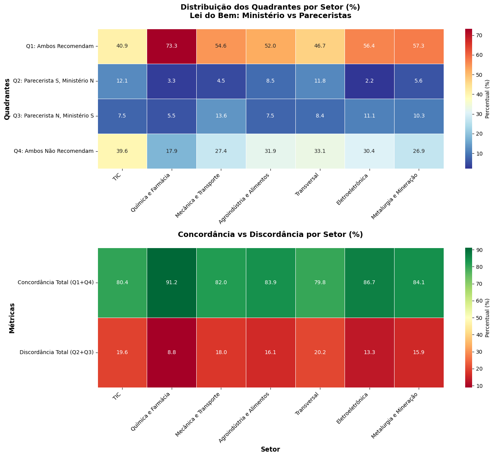

    📋 TABELA DETALHADA POR SETOR:
    ========================================================================================================================
    Setor                                Q1(S,S)  Q2(S,N)  Q3(N,S)  Q4(N,N)  Concord.  Discord.    Total
    ------------------------------------------------------------------------------------------------------------------------
    TIC                                    40.9%    12.1%     7.5%    39.6%     80.4%     19.6%    18772
    Química e Farmácia                     73.3%     3.3%     5.5%    17.9%     91.2%      8.8%    12845
    Mecânica e Transporte                  54.6%     4.5%    13.6%    27.4%     82.0%     18.0%     9068
    Agroindústria e Alimentos              52.0%     8.5%     7.5%    31.9%     83.9%     16.1%     8144
    Transversal                            46.7%    11.8%     8.4%    33.1%     79.8%     20.2%     7467
    Eletroeletrônica                       56.4%     2.2%    11.1%    30.4%     86.7%     13.3%     7158
    Metalurgia e Mineração                 57.3%     5.6%    10.3%    26.9%     84.1%     15.9%     4989
    ========================================================================================================================

    🔍 ANÁLISE DE PADRÕES SETORIAIS:
    ------------------------------------------------------------
    ✅ Maior Concordância: Química e Farmácia
       └── 91.2% (12845 projetos)
    ⚠️  Maior Discordância: Transversal
       └── 20.2% (7467 projetos)
    🟢 Maior Q1 (S,S): Química e Farmácia
       └── 73.3% (12845 projetos)
    🔴 Maior Q4 (N,N): TIC
       └── 39.6% (18772 projetos)

    📊 ESTATÍSTICAS GERAIS:
    └── Concordância média entre setores: 84.0%
    └── Discordância média entre setores: 16.0%
    └── Variação na concordância: 3.9% (desvio padrão)

    💾 Resultados exportados para 'quadrantes_por_setor.csv'

    ================================================================================
    HEATMAP POR SETOR CONCLUÍDO
    ================================================================================

### Análise dos quadrantes por Setor ao longo dos Anos

    ================================================================================
    HEATMAP DOS QUADRANTES DE DECISÃO - ANÁLISE POR SETOR E ANO
    Lei do Bem: Evolução Temporal por Setor (2018-2022)
    ================================================================================
    📊 Projetos válidos para análise: 68,443

    ============================================================
    ANÁLISE DO ANO: 2018
    ============================================================
    📊 Projetos no ano 2018: 10,852

    📊 Estatísticas 2018:
    ├── Concordância média: 68.7%
    ├── Discordância média: 31.3%
    ├── Setor com maior concordância: Química e Farmácia (80.0%)
    └── Setor com maior discordância: Agroindústria e Alimentos (40.8%)

    ============================================================
    ANÁLISE DO ANO: 2019
    ============================================================
    📊 Projetos no ano 2019: 12,168

    📊 Estatísticas 2019:
    ├── Concordância média: 84.5%
    ├── Discordância média: 15.5%
    ├── Setor com maior concordância: Mecânica e Transporte (93.0%)
    └── Setor com maior discordância: Eletroeletrônica (25.9%)

    ============================================================
    ANÁLISE DO ANO: 2020
    ============================================================
    📊 Projetos no ano 2020: 11,653

    📊 Estatísticas 2020:
    ├── Concordância média: 91.9%
    ├── Discordância média: 8.1%
    ├── Setor com maior concordância: Química e Farmácia (97.1%)
    └── Setor com maior discordância: Mecânica e Transporte (17.6%)

    ============================================================
    ANÁLISE DO ANO: 2021
    ============================================================
    📊 Projetos no ano 2021: 13,194

    📊 Estatísticas 2021:
    ├── Concordância média: 82.2%
    ├── Discordância média: 17.8%
    ├── Setor com maior concordância: Química e Farmácia (92.3%)
    └── Setor com maior discordância: TIC (36.8%)

    ============================================================
    ANÁLISE DO ANO: 2022
    ============================================================
    📊 Projetos no ano 2022: 13,786

    📊 Estatísticas 2022:
    ├── Concordância média: 84.3%
    ├── Discordância média: 15.7%
    ├── Setor com maior concordância: Eletroeletrônica (99.2%)
    └── Setor com maior discordância: Transversal (26.6%)

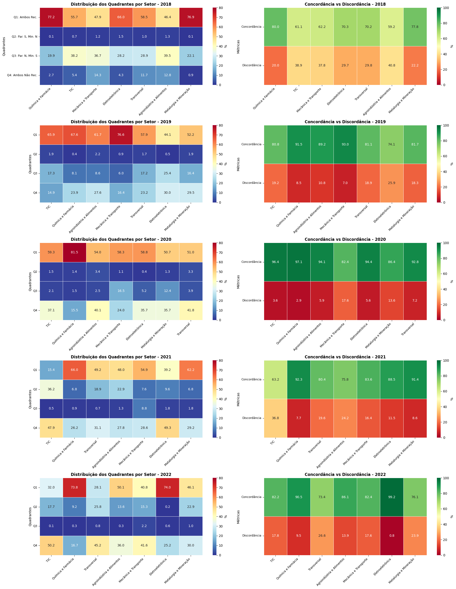

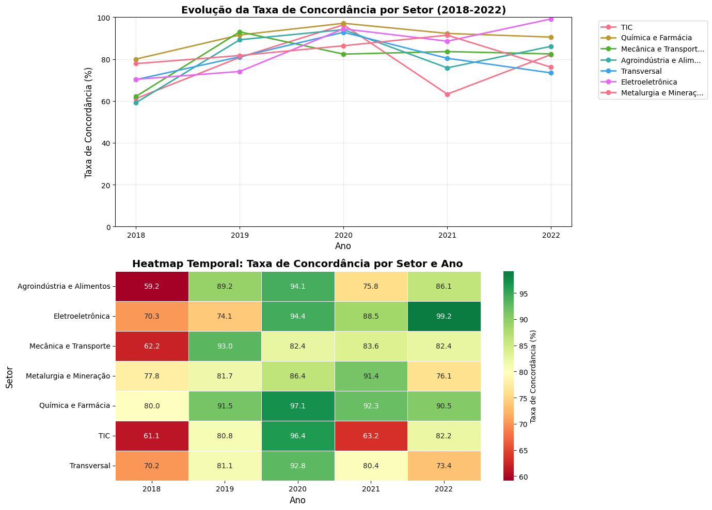

    🔍 ANÁLISE DE TENDÊNCIAS TEMPORAIS POR SETOR:
    ================================================================================

    TIC:
    ├── 2018: 61.1% → 2022: 82.2%
    ├── Variação: +21.0%
    └── Tendência: 📈 Aumento

    Química e Farmácia:
    ├── 2018: 80.0% → 2022: 90.5%
    ├── Variação: +10.5%
    └── Tendência: 📈 Aumento

    Mecânica e Transporte:
    ├── 2018: 62.2% → 2022: 82.4%
    ├── Variação: +20.3%
    └── Tendência: 📈 Aumento

    Agroindústria e Alimentos:
    ├── 2018: 59.2% → 2022: 86.1%
    ├── Variação: +26.9%
    └── Tendência: 📈 Aumento

    Transversal:
    ├── 2018: 70.2% → 2022: 73.4%
    ├── Variação: +3.2%
    └── Tendência: ➡️ Estável

    Eletroeletrônica:
    ├── 2018: 70.3% → 2022: 99.2%
    ├── Variação: +28.9%
    └── Tendência: 📈 Aumento

    Metalurgia e Mineração:
    ├── 2018: 77.8% → 2022: 76.1%
    ├── Variação: -1.7%
    └── Tendência: ➡️ Estável

    📊 TABELA COMPARATIVA: CONCORDÂNCIA POR SETOR E ANO
    ====================================================================================================
    Setor                                  2018         2019         2020         2021         2022        Média
    ----------------------------------------------------------------------------------------------------
    TIC                                  61.1%       80.8%       96.4%       63.2%       82.2%       76.7%
    Química e Farmácia                   80.0%       91.5%       97.1%       92.3%       90.5%       90.3%
    Mecânica e Transporte                62.2%       93.0%       82.4%       83.6%       82.4%       80.7%
    Agroindústria e Alimentos            59.2%       89.2%       94.1%       75.8%       86.1%       80.9%
    Transversal                          70.2%       81.1%       92.8%       80.4%       73.4%       79.6%
    Eletroeletrônica                     70.3%       74.1%       94.4%       88.5%       99.2%       85.3%
    Metalurgia e Mineração               77.8%       81.7%       86.4%       91.4%       76.1%       82.7%
    ====================================================================================================

    💾 Dados exportados para 'evolucao_quadrantes_setor_ano.csv'

    ================================================================================
    ANÁLISE TEMPORAL POR SETOR CONCLUÍDA
    ================================================================================

### Análise Textual por Quadrante e Setor

    ================================================================================
    ANÁLISE TEXTUAL POR QUADRANTE E SETOR
    Lei do Bem: Palavras-chave por tipo de decisão
    ================================================================================
    📊 Campos textuais identificados: 6
       • daproj_noprojeto
       • daproj_dsprojeto
       • daproj_dspalavrachave
       • daproj_dselementotecnologico
       • daproj_dsdesafiotecnologico
       • daproj_dsmetodologiautilizada

    Combinando campos textuais...

    📊 Projetos válidos para análise: 68,437

    🏭 Setores principais para análise:
    1. TIC: 18,769 projetos
    2. Química e Farmácia: 12,845 projetos
    3. Mecânica e Transporte: 9,067 projetos
    4. Agroindústria e Alimentos: 8,144 projetos
    5. Transversal: 7,466 projetos
    6. Eletroeletrônica: 7,157 projetos

    Analisando setor: TIC
    ------------------------------------------------------------

    Q1 (7670 projetos):
    Top 10 palavras:
       • dados: 58213
       • sistema: 39860
       • informações: 25176
       • testes: 24361
       • sistemas: 23122
       • solução: 22163
       • além: 21861
       • integração: 21233
       • equipe: 19488
       • plataforma: 19392

    Q2 (2268 projetos):
    Top 10 palavras:
       • dados: 21333
       • sistema: 11437
       • informações: 8744
       • solução: 7909
       • plataforma: 7808
       • testes: 7582
       • integração: 7537
       • além: 7025
       • soluções: 6697
       • cada: 6608

    Q3 (1408 projetos):
    Top 10 palavras:
       • dados: 6380
       • sistema: 5919
       • informações: 3757
       • sistemas: 3348
       • testes: 3343
       • solução: 3095
       • além: 3073
       • integração: 2929
       • plataforma: 2919
       • cada: 2603

    Q4 (7423 projetos):
    Top 10 palavras:
       • dados: 60879
       • sistema: 38602
       • integração: 27340
       • informações: 26014
       • sistemas: 25483
       • testes: 23913
       • equipe: 23606
       • soluções: 22970
       • além: 22496
       • plataforma: 22038

    Analisando setor: Química e Farmácia
    ------------------------------------------------------------

    Q1 (9415 projetos):
    Top 10 palavras:
       • produto: 36639
       • testes: 34574
       • produtos: 27754
       • estudos: 22150
       • além: 20621
       • estudo: 18699
       • formulação: 18355
       • produção: 16513
       • tratamento: 15407
       • qualidade: 14257

    Q2 (424 projetos):
    Top 10 palavras:
       • testes: 1720
       • produto: 1661
       • produtos: 1608
       • além: 1178
       • qualidade: 1126
       • sistema: 1118
       • estudos: 1029
       • equipe: 935
       • formulação: 851
       • tratamento: 848

    Q3 (710 projetos):
    Top 10 palavras:
       • testes: 1835
       • produto: 1536
       • produtos: 1392
       • estudos: 1350
       • sistema: 1075
       • estudo: 1064
       • além: 994
       • tratamento: 917
       • qualidade: 813
       • produção: 774

    Q4 (2296 projetos):
    Top 10 palavras:
       • produto: 5682
       • testes: 4231
       • produtos: 3925
       • além: 2744
       • estudos: 2716
       • sistema: 2708
       • produção: 2363
       • qualidade: 2273
       • estudo: 2227
       • formulação: 2161

    Analisando setor: Mecânica e Transporte
    ------------------------------------------------------------

    Q1 (4952 projetos):
    Top 10 palavras:
       • sistema: 24626
       • testes: 22110
       • produto: 12273
       • além: 11301
       • componentes: 9800
       • maior: 9699
       • estudos: 8763
       • durante: 8643
       • sistemas: 7941
       • produção: 7888

    Q2 (404 projetos):
    Top 10 palavras:
       • sistema: 2240
       • testes: 1529
       • além: 1467
       • qualidade: 1317
       • equipe: 1068
       • produtos: 1054
       • produção: 1043
       • linha: 992
       • dados: 971
       • maior: 966

    Q3 (1230 projetos):
    Top 10 palavras:
       • sistema: 3913
       • testes: 3798
       • produto: 2422
       • além: 1832
       • componentes: 1742
       • maior: 1723
       • estudos: 1598
       • veículo: 1571
       • durante: 1459
       • produção: 1440

    Q4 (2481 projetos):
    Top 10 palavras:
       • sistema: 7077
       • testes: 6784
       • além: 4005
       • produto: 3871
       • qualidade: 3596
       • estudos: 3281
       • produtos: 3279
       • produção: 3253
       • linha: 3010
       • garantir: 2942

    Analisando setor: Agroindústria e Alimentos
    ------------------------------------------------------------

    Q1 (4236 projetos):
    Top 10 palavras:
       • produto: 16785
       • testes: 14301
       • produtos: 14222
       • além: 10045
       • produção: 9070
       • estudos: 8758
       • diferentes: 8638
       • qualidade: 8429
       • maior: 8312
       • aplicação: 7868

    Q2 (694 projetos):
    Top 10 palavras:
       • produtos: 3809
       • produto: 3048
       • testes: 2737
       • produção: 2314
       • além: 2232
       • qualidade: 2183
       • controle: 1886
       • maior: 1831
       • estudos: 1700
       • aplicação: 1619

    Q3 (614 projetos):
    Top 10 palavras:
       • produto: 1998
       • sistema: 1542
       • testes: 1402
       • produtos: 1305
       • produção: 1030
       • além: 975
       • estudos: 882
       • maior: 821
       • qualidade: 808
       • linha: 740

    Q4 (2600 projetos):
    Top 10 palavras:
       • produto: 6366
       • produtos: 6330
       • testes: 5186
       • sistema: 5102
       • produção: 5056
       • qualidade: 4448
       • além: 4132
       • maior: 3354
       • controle: 3112
       • linha: 2915

    Analisando setor: Transversal
    ------------------------------------------------------------

    Q1 (3489 projetos):
    Top 10 palavras:
       • testes: 12283
       • produto: 10725
       • produtos: 9538
       • sistema: 8614
       • além: 7917
       • produção: 7507
       • qualidade: 6953
       • maior: 6713
       • aplicação: 6271
       • estudos: 5606

    Q2 (879 projetos):
    Top 10 palavras:
       • testes: 3192
       • produto: 3017
       • produtos: 2653
       • sistema: 2565
       • além: 2240
       • qualidade: 1963
       • dados: 1707
       • produção: 1660
       • equipe: 1628
       • maior: 1564

    Q3 (630 projetos):
    Top 10 palavras:
       • testes: 1626
       • produto: 1475
       • produtos: 1337
       • sistema: 1313
       • além: 983
       • maior: 979
       • linha: 926
       • produção: 859
       • qualidade: 824
       • estudos: 786

    Q4 (2468 projetos):
    Top 10 palavras:
       • produtos: 6251
       • sistema: 5786
       • testes: 5436
       • produto: 5035
       • qualidade: 4765
       • além: 4545
       • produção: 3980
       • maior: 3387
       • equipe: 3326
       • estudo: 3169

    Analisando setor: Eletroeletrônica
    ------------------------------------------------------------

    Q1 (4035 projetos):
    Top 10 palavras:
       • sistema: 19581
       • testes: 11869
       • dados: 9648
       • energia: 9538
       • produto: 9367
       • além: 8638
       • controle: 7700
       • sistemas: 7619
       • análise: 6389
       • maior: 5910

    Q2 (157 projetos):
    Top 10 palavras:
       • sistema: 1119
       • testes: 472
       • energia: 428
       • controle: 421
       • dados: 351
       • além: 341
       • sistemas: 337
       • produto: 331
       • tempo: 307
       • maior: 292

    Q3 (792 projetos):
    Top 10 palavras:
       • sistema: 3016
       • testes: 1943
       • produto: 1685
       • dados: 1408
       • energia: 1226
       • controle: 1178
       • além: 1111
       • produtos: 1094
       • cada: 1050
       • sistemas: 1034

    Q4 (2173 projetos):
    Top 10 palavras:
       • sistema: 9353
       • testes: 4917
       • produto: 4540
       • dados: 3561
       • além: 3535
       • energia: 3505
       • sistemas: 3200
       • estudos: 3153
       • transmissão: 3027
       • controle: 3002

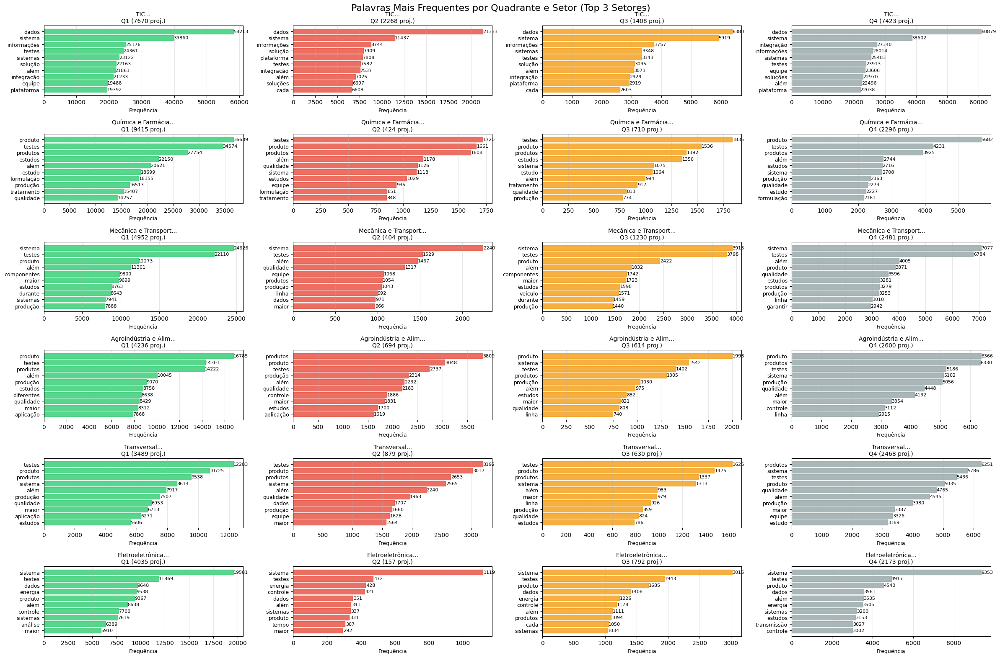

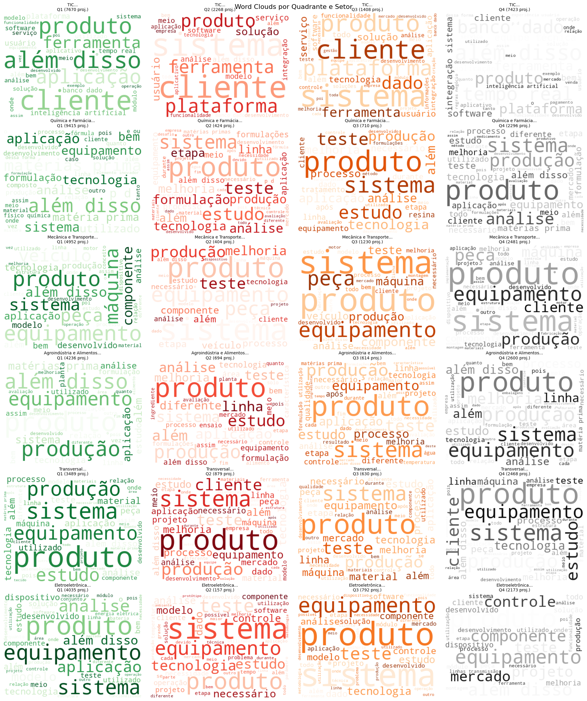

    🔍 ANÁLISE COMPARATIVA DE TERMOS POR QUADRANTE
    ================================================================================

    📌 TIC
    ------------------------------------------------------------

    Q1 - Termos Distintivos:

    Q2 - Termos Distintivos:

    Q3 - Termos Distintivos:

    Q4 - Termos Distintivos:

    📌 Química e Farmácia
    ------------------------------------------------------------

    Q1 - Termos Distintivos:
       • pacientes: freq=8177, distintividade=0.89
       • formulações: freq=12658, distintividade=0.87
       • resultados: freq=11644, distintividade=0.85
       • avaliação: freq=13812, distintividade=0.84
       • medicamento: freq=8956, distintividade=0.84

    Q2 - Termos Distintivos:

    Q3 - Termos Distintivos:

    Q4 - Termos Distintivos:

    📌 Mecânica e Transporte
    ------------------------------------------------------------

    Q1 - Termos Distintivos:
       • motor: freq=5660, distintividade=0.73
       • veículos: freq=6022, distintividade=0.69
       • resistência: freq=5664, distintividade=0.68
       • aplicação: freq=7636, distintividade=0.67
       • veículo: freq=5241, distintividade=0.66

    Q2 - Termos Distintivos:

    Q3 - Termos Distintivos:

    Q4 - Termos Distintivos:

    📌 Agroindústria e Alimentos
    ------------------------------------------------------------

    Q1 - Termos Distintivos:
       • plantas: freq=4304, distintividade=0.71
       • formulações: freq=4683, distintividade=0.68
       • ingredientes: freq=4395, distintividade=0.66
       • diferentes: freq=8638, distintividade=0.65
       • condições: freq=4782, distintividade=0.65

    Q2 - Termos Distintivos:

    Q3 - Termos Distintivos:

    Q4 - Termos Distintivos:
       • embalagem: freq=1885, distintividade=0.51

    📌 Transversal
    ------------------------------------------------------------

    Q1 - Termos Distintivos:
       • papel: freq=3300, distintividade=0.67
       • propriedades: freq=3344, distintividade=0.66
       • resistência: freq=5177, distintividade=0.61
       • material: freq=5302, distintividade=0.60
       • características: freq=4147, distintividade=0.59

    Q2 - Termos Distintivos:

    Q3 - Termos Distintivos:

    Q4 - Termos Distintivos:

    📌 Eletroeletrônica
    ------------------------------------------------------------

    Q1 - Termos Distintivos:
       • geração: freq=4603, distintividade=0.68
       • desafios: freq=4082, distintividade=0.67
       • operação: freq=4836, distintividade=0.66
       • comunicação: freq=4541, distintividade=0.66
       • rede: freq=4604, distintividade=0.66

    Q2 - Termos Distintivos:

    Q3 - Termos Distintivos:

    Q4 - Termos Distintivos:
       • transmissão: freq=3027, distintividade=0.51

    📊 TABELA RESUMO: CARACTERÍSTICAS TEXTUAIS POR QUADRANTE
    ====================================================================================================
    Setor                          Quadrante    Projetos Top 3 Palavras                                    
    ----------------------------------------------------------------------------------------------------
    TIC                            Q1               7670 dados(58213), sistema(39860), informações(25176)  
    TIC                            Q2               2268 dados(21333), sistema(11437), informações(8744)   
    TIC                            Q3               1408 dados(6380), sistema(5919), informações(3757)     
    TIC                            Q4               7423 dados(60879), sistema(38602), integração(27340)   
    Química e Farmácia             Q1               9415 produto(36639), testes(34574), produtos(27754)    
    Química e Farmácia             Q2                424 testes(1720), produto(1661), produtos(1608)       
    Química e Farmácia             Q3                710 testes(1835), produto(1536), produtos(1392)       
    Química e Farmácia             Q4               2296 produto(5682), testes(4231), produtos(3925)       
    Mecânica e Transporte          Q1               4952 sistema(24626), testes(22110), produto(12273)     
    Mecânica e Transporte          Q2                404 sistema(2240), testes(1529), além(1467)           
    Mecânica e Transporte          Q3               1230 sistema(3913), testes(3798), produto(2422)        
    Mecânica e Transporte          Q4               2481 sistema(7077), testes(6784), além(4005)           
    Agroindústria e Alimentos      Q1               4236 produto(16785), testes(14301), produtos(14222)    
    Agroindústria e Alimentos      Q2                694 produtos(3809), produto(3048), testes(2737)       
    Agroindústria e Alimentos      Q3                614 produto(1998), sistema(1542), testes(1402)        
    Agroindústria e Alimentos      Q4               2600 produto(6366), produtos(6330), testes(5186)       
    Transversal                    Q1               3489 testes(12283), produto(10725), produtos(9538)     
    Transversal                    Q2                879 testes(3192), produto(3017), produtos(2653)       
    Transversal                    Q3                630 testes(1626), produto(1475), produtos(1337)       
    Transversal                    Q4               2468 produtos(6251), sistema(5786), testes(5436)       
    Eletroeletrônica               Q1               4035 sistema(19581), testes(11869), dados(9648)        
    Eletroeletrônica               Q2                157 sistema(1119), testes(472), energia(428)          
    Eletroeletrônica               Q3                792 sistema(3016), testes(1943), produto(1685)        
    Eletroeletrônica               Q4               2173 sistema(9353), testes(4917), produto(4540)        
    ====================================================================================================

    💾 Exportando resultados...
    ✅ Arquivo 'analise_textual_quadrantes_setor.csv' exportado com sucesso!

    ================================================================================
    ANÁLISE TEXTUAL POR QUADRANTE E SETOR CONCLUÍDA
    ================================================================================

#### Distintividade

A distintividade é uma métrica que mede o quão específica ou
característica uma palavra é para um determinado quadrante em comparação
com os outros quadrantes.

Fórmula Implementada:

    Distintividade = freq_quadrante / (freq_quadrante + freq_outros_quadrantes + 1)

Onde:

freq_quadrante = frequência da palavra no quadrante analisado

freq_outros_quadrantes = soma das frequências da palavra em todos os
outros quadrantes

+1 = fator de suavização para evitar divisão por zero

##### Interpretação:

Distintividade = 1.0: A palavra aparece APENAS neste quadrante

Distintividade = 0.5: A palavra aparece com a mesma frequência neste
quadrante e nos outros combinados

Distintividade = 0.0: A palavra nunca aparece neste quadrante

### Análise por Setor

Este bloco de código executa uma análise detalhada das taxas de
aprovação de projetos organizados por área/setor. O código primeiro
padroniza as decisões dos avaliadores (analista/DO e
parecerista/Parecer) em três categorias: “Recomendado”, “Não
Recomendado” ou “Outro”. Em seguida, filtra os dados para incluir apenas
projetos com área definida, resultando em 68.443 projetos válidos
distribuídos em 7 áreas únicas.

A saída apresenta a distribuição das áreas ordenadas por volume, sendo
TIC a maior com 18.772 projetos, seguida por Química e Farmácia com
12.845 projetos. O código calcula estatísticas gerais mostrando uma taxa
média de aprovação de 61,3% na fase DO e 63,6% na fase Parecer, com uma
diferença média positiva de 2,3% entre as fases.

A tabela principal exibe as 20 principais áreas por volume, mostrando
para cada uma: o total de projetos, as taxas de aprovação em cada fase
(DO e Parecer), a diferença percentual entre as fases e o número de
projetos que mudaram de decisão entre as avaliações. Por exemplo, TIC
apresenta 19,6% de projetos que mudaram de decisão (3.676 de 18.772
projetos).

A seção de destaques identifica padrões importantes: áreas com maiores
taxas de aprovação em cada fase, áreas com maior queda ou aumento entre
as fases DO e Parecer, e áreas com maior taxa de mudança de decisão.
Metalurgia e Mineração lidera com 15,9% de projetos que mudaram de
decisão, indicando maior discordância entre avaliadores neste setor. O
código fornece uma visão abrangente do desempenho de aprovação por setor
e identifica onde há maior convergência ou divergência entre as duas
fases de avaliação.

    📊 ANÁLISE DE APROVAÇÃO POR ÁREA DO PROJETO
    ================================================================================
    ✅ Usando coluna 'do_set_nosetor' (Área do Projeto)
    📊 Projetos com área definida: 68,443

    📊 Distribuição das Áreas de Projeto:
    Total de áreas únicas: 7

    Top 15 áreas por volume:
     1. TIC: 18,772 projetos
     2. Química e Farmácia: 12,845 projetos
     3. Mecânica e Transporte: 9,068 projetos
     4. Agroindústria e Alimentos: 8,144 projetos
     5. Transversal: 7,467 projetos
     6. Eletroeletrônica: 7,158 projetos
     7. Metalurgia e Mineração: 4,989 projetos

    📊 ESTATÍSTICAS GERAIS:
    Total de áreas analisadas: 7
    Taxa média de aprovação DO: 61.3%
    Taxa média de aprovação Parecer: 63.6%
    Diferença média (Parecer - DO): 2.3%

    📋 TABELA DE APROVAÇÃO POR ÁREA DO PROJETO (Top 20 por volume)
    ==================================================================================================================================
    Área do Projeto                            Projetos      Taxa DO Taxa Parecer    Diferença    Mudaram
    ----------------------------------------------------------------------------------------------------------------------------------
    TIC                                           18772        52.9%        48.4%        -4.6%       3676
    Química e Farmácia                            12845        76.6%        78.8%         2.2%       1134
    Mecânica e Transporte                          9068        59.1%        68.2%         9.1%       1634
    Agroindústria e Alimentos                      8144        60.5%        59.6%        -1.0%       1308
    Transversal                                    7467        58.5%        55.2%        -3.3%       1509
    Eletroeletrônica                               7158        58.6%        67.4%         8.9%        949
    Metalurgia e Mineração                         4989        62.8%        67.6%         4.8%        791
    ==================================================================================================================================

    🔍 DESTAQUES DA ANÁLISE POR ÁREA DO PROJETO:

    Áreas com MAIOR taxa de aprovação no DO:
      - Química e Farmácia: 76.6% (12845 projetos)
      - Metalurgia e Mineração: 62.8% (4989 projetos)
      - Agroindústria e Alimentos: 60.5% (8144 projetos)
      - Mecânica e Transporte: 59.1% (9068 projetos)
      - Eletroeletrônica: 58.6% (7158 projetos)

    Áreas com MAIOR taxa de aprovação no Parecer:
      - Química e Farmácia: 78.8% (12845 projetos)
      - Mecânica e Transporte: 68.2% (9068 projetos)
      - Metalurgia e Mineração: 67.6% (4989 projetos)
      - Eletroeletrônica: 67.4% (7158 projetos)
      - Agroindústria e Alimentos: 59.6% (8144 projetos)

    Áreas com MAIOR QUEDA entre DO e Parecer:
      - TIC: -4.6% de queda (18772 projetos)
      - Transversal: -3.3% de queda (7467 projetos)
      - Agroindústria e Alimentos: -1.0% de queda (8144 projetos)

    Áreas com MAIOR AUMENTO entre DO e Parecer:
      - Mecânica e Transporte: +9.1% de aumento (9068 projetos)
      - Eletroeletrônica: +8.9% de aumento (7158 projetos)
      - Metalurgia e Mineração: +4.8% de aumento (4989 projetos)
      - Química e Farmácia: +2.2% de aumento (12845 projetos)

    Áreas com MAIOR taxa de mudança de decisão:
      - Transversal: 20.2% mudaram decisão (1509 de 7467 projetos)
      - TIC: 19.6% mudaram decisão (3676 de 18772 projetos)
      - Mecânica e Transporte: 18.0% mudaram decisão (1634 de 9068 projetos)
      - Agroindústria e Alimentos: 16.1% mudaram decisão (1308 de 8144 projetos)
      - Metalurgia e Mineração: 15.9% mudaram decisão (791 de 4989 projetos)

### Visualização por Setor

#### Gráfico 4.4 - Taxa de Aprovação por Área do Projeto: Comparação DO vs Parecer

Este gráfico de barras agrupadas compara as taxas de aprovação entre
duas fases de avaliação (DO e Parecer) para as 15 áreas com maior volume
de projetos. As barras azuis representam a taxa de aprovação na fase DO
(primeira avaliação) e as barras vermelhas representam a taxa na fase
Parecer (segunda avaliação). Cada par de barras corresponde a uma área
específica, com os valores percentuais exibidos acima de cada barra. O
eixo vertical mostra a taxa de aprovação em percentual, variando de 0 a
100%. As áreas estão ordenadas por volume total de projetos, sendo TIC a
área com maior número de projetos analisados. A grade horizontal
facilita a leitura dos valores percentuais.

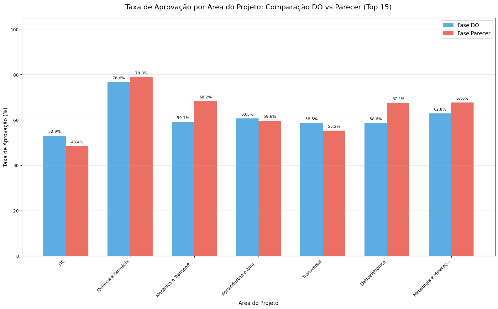

#### Gráfico 4.5 - Correlação entre Taxas de Aprovação DO e Parecer por Área do Projeto

Este gráfico de dispersão mostra a relação entre as taxas de aprovação
das duas fases de avaliação. No eixo horizontal está a taxa de aprovação
na fase DO e no eixo vertical a taxa na fase Parecer. Cada círculo
representa uma área diferente, sendo que o tamanho do círculo é
proporcional ao número total de projetos daquela área (círculos maiores
indicam áreas com mais projetos). A cor dos círculos segue uma escala
que vai do vermelho ao azul, representando a diferença percentual entre
as taxas (Parecer menos DO). A linha diagonal tracejada representa o
ponto onde as taxas seriam iguais nas duas fases. Áreas específicas como
TIC, Química e Farmácia, e Mecânica e Transporte estão identificadas com
rótulos devido ao seu volume significativo ou diferença expressiva entre
as fases.

#### Gráfico 4.6 - Análise Detalhada por Área do Projeto

Este mapa de calor apresenta uma visão consolidada de quatro métricas
diferentes para as 20 áreas com maior volume de projetos. As linhas
representam: Taxa de Aprovação DO, Taxa de Aprovação Parecer, Taxa de
Mudança de Decisão (percentual de projetos que tiveram decisão diferente
entre as fases) e Diferença (Parecer-DO). Cada célula contém o valor
numérico da métrica e é colorida segundo uma escala que vai do azul
escuro (valores mais negativos) ao vermelho escuro (valores mais
positivos), com o branco representando valores próximos a zero. Esta
escala de cores está centrada em zero, facilitando a identificação
visual de valores positivos e negativos, especialmente útil para a linha
de Diferença onde valores negativos indicam queda na taxa de aprovação e
positivos indicam aumento.

    💾 Resultados exportados para 'analise_aprovacao_por_area_projeto.csv'

    📊 ESTATÍSTICAS ADICIONAIS:
    Áreas com 100% aprovação no Parecer: 0
    Áreas com 0% aprovação no Parecer: 0
    Área com maior volume: TIC (18772 projetos)
    Diferença máxima (Parecer-DO): 9.1%
    Diferença mínima (Parecer-DO): -4.6%

### Análise e Insights por Setor

**O que foi investigado:**

Esta análise focou em identificar padrões de aprovação por setor nas
duas fases principais do processo (DO e Parecer), quantificando as
diferenças entre as decisões dos analistas técnicos e dos pareceristas
para cada setor de atividade.

**Principais Descobertas:**

A análise setorial revela significativas disparidades nas taxas de
aprovação entre diferentes setores e entre as fases do processo:

-   **Variação Setorial**: As taxas de aprovação variam drasticamente
    entre setores, tanto na fase DO quanto no Parecer
-   **Tendência Geral**: A maioria dos setores apresenta queda na taxa
    de aprovação entre DO e Parecer, confirmando que os pareceristas
    aplicam critérios mais rigorosos
-   **Setores Favorecidos**: Alguns setores mantêm altas taxas de
    aprovação em ambas as fases
-   **Setores Penalizados**: Certos setores sofrem quedas dramáticas
    entre as fases

**Padrões Identificados:**

1.  **Setores de Alta Performance**: Setores com taxas superiores a 80%
    em ambas as fases
2.  **Setores de Queda Acentuada**: Setores que perdem mais de 20 pontos
    percentuais entre DO e Parecer
3.  **Setores de Reversão**: Raros casos onde a taxa no Parecer supera a
    do DO
4.  **Setores Voláteis**: Alta taxa de mudança de decisão entre fases

**Insights e Implicações Práticas:**

1.  **Especialização Setorial**: A variação nas taxas sugere que
    diferentes setores requerem expertise específica para avaliação
    adequada

2.  **Necessidade de Padronização**: As grandes diferenças entre setores
    podem indicar falta de critérios uniformes ou vieses setoriais

3.  **Oportunidade de Capacitação**: Setores com altas taxas de mudança
    entre fases podem se beneficiar de treinamento específico para
    analistas

4.  **Revisão de Critérios**: Setores com quedas sistemáticas merecem
    revisão dos critérios de avaliação aplicados

### 5. Análise de Concordância por Área do Projeto - Foco nos Quadrantes 1 e 4

#### Gráfico 5.1 - Análise de Concordância por Área: Q1 vs Q4

Este gráfico de dispersão apresenta a relação entre duas métricas de
concordância. No eixo horizontal (X) está representada a Taxa de
Concordância Positiva Q1, que indica o percentual de projetos onde tanto
o pesquisador quanto o ministério recomendam o projeto.

No eixo vertical (Y) está a Taxa de Concordância Negativa Q4,
representando o percentual onde ambos os avaliadores não recomendam.
Cada círculo no gráfico representa uma área diferente, sendo que o
tamanho do círculo é proporcional ao número total de projetos daquela
área.

A cor dos círculos varia de acordo com a concordância total (Q1+Q4),
seguindo uma escala de cores do roxo ao amarelo. As linhas tracejadas
indicam as médias de Q1 (54,5%) e Q4 (29,6%), enquanto a linha diagonal
representa o ponto de equilíbrio onde Q1 seria igual a Q4. O gráfico
inclui apenas áreas com 20 ou mais projetos para garantir
representatividade estatística.

    ================================================================================
    ANÁLISE DE CONCORDÂNCIA POR ÁREA DO PROJETO
    Foco: Quadrantes 1 (ambos recomendam) e 4 (ambos não recomendam)
    ================================================================================

    📊 ESTATÍSTICAS GERAIS:
    Total de áreas analisadas: 7
    Taxa média de concordância total: 84.0%
    Taxa média de concordância positiva (Q1): 54.5%
    Taxa média de concordância negativa (Q4): 29.6%

    🏆 TOP 10 ÁREAS COM MAIOR CONCORDÂNCIA TOTAL (Q1+Q4):
    --------------------------------------------------------------------------------
     1. Química e Farmácia                       | Conc:  91.2% | Q1:  73.3% | Q4:  17.9% | (12845 projetos)
     2. Eletroeletrônica                         | Conc:  86.7% | Q1:  56.4% | Q4:  30.4% | (7158 projetos)
     3. Metalurgia e Mineração                   | Conc:  84.1% | Q1:  57.3% | Q4:  26.9% | (4989 projetos)
     4. Agroindústria e Alimentos                | Conc:  83.9% | Q1:  52.0% | Q4:  31.9% | (8144 projetos)
     5. Mecânica e Transporte                    | Conc:  82.0% | Q1:  54.6% | Q4:  27.4% | (9068 projetos)
     6. TIC                                      | Conc:  80.4% | Q1:  40.9% | Q4:  39.6% | (18772 projetos)
     7. Transversal                              | Conc:  79.8% | Q1:  46.7% | Q4:  33.1% | (7467 projetos)

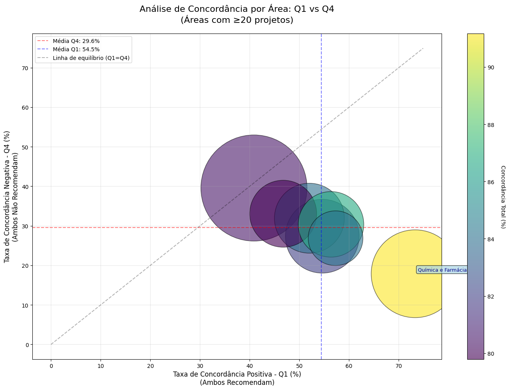

#### Gráfico 5.2 - Distribuição dos Quadrantes por Área

Este conjunto de dois gráficos de barras mostra a distribuição
percentual dos quatro quadrantes de decisão para as 15 áreas com maior
volume de projetos.

O gráfico superior apresenta barras empilhadas onde cada segmento
colorido representa um quadrante: verde para Q1 (ambos recomendam),
vermelho para Q2 (pesquisador recomenda, ministério não), laranja para
Q3 (pesquisador não recomenda, ministério sim) e cinza para Q4 (ambos
não recomendam).

A altura total de cada barra sempre soma 100%, mostrando a distribuição
completa das decisões. O gráfico inferior foca especificamente na
comparação entre Q1 e Q4, usando barras lado a lado para facilitar a
comparação direta entre concordância positiva (verde) e negativa (cinza)
em cada área, com os valores percentuais exibidos acima de cada barra.

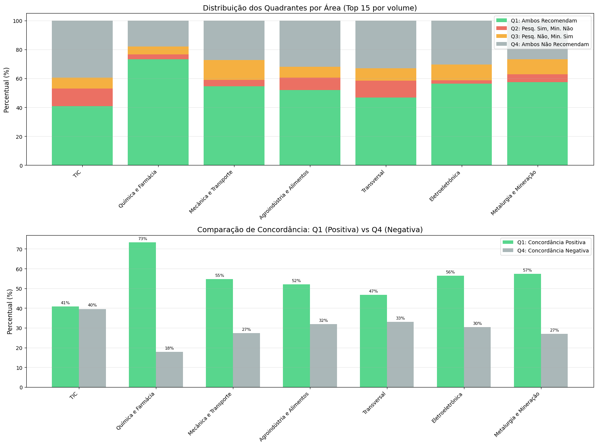

#### Gráfico 5.3 - Heatmap de Concordância por Área

Este mapa de calor apresenta uma matriz onde as colunas representam as
20 áreas com maior volume de projetos e as linhas mostram quatro
métricas diferentes: Q1 (Concordância Positiva), Q4 (Concordância
Negativa), Concordância Total e Discordância Total. Cada célula contém o
valor percentual correspondente e é colorida segundo uma escala que vai
do vermelho ao verde, passando pelo amarelo. Valores mais altos aparecem
em tons de verde, valores médios em amarelo e valores mais baixos em
vermelho. O centro da escala de cores está fixado em 50%, facilitando a
identificação visual de valores acima ou abaixo deste ponto médio. Os
valores numéricos são exibidos dentro de cada célula para precisão, e as
bordas cinzas delimitam cada célula individual.

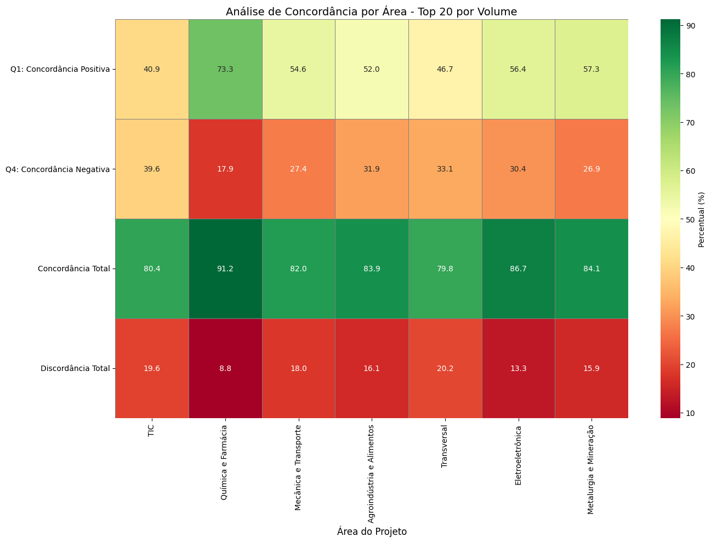

    🔍 PADRÕES ESPECIAIS DE CONCORDÂNCIA:
    --------------------------------------------------------------------------------

    ✅ Áreas com ALTA concordância positiva (Q1 > 70%):
       • Química e Farmácia: 73.3% (9415 de 12845 projetos)

    ⚖️ Áreas EQUILIBRADAS (diferença Q1-Q4 < 10%):
       • TIC: Q1=40.9%, Q4=39.6% (18772 projetos)

    💾 Resultados exportados para 'analise_concordancia_por_area.csv'

### 6. Análise por setor para Q2 e Q3

#### Tabelas 6.1 e 6.2 - Top 5 Setores Q2 e Q3

Estas duas tabelas apresentam os cinco setores com as maiores taxas
percentuais de discordância em cada quadrante. A primeira tabela, com
fundo rosa, mostra os setores onde o ministério é mais rigoroso (Q2),
enquanto a segunda tabela, com fundo azul, mostra onde o pesquisador é
mais rigoroso (Q3). Cada tabela contém quatro colunas: o nome do setor,
a taxa percentual do quadrante correspondente, o número absoluto de
projetos naquele quadrante e o total de projetos do setor. Os setores
estão ordenados pela taxa percentual em ordem decrescente e numerados de
1 a 5.

    ====================================================================================================
    ANÁLISE APROFUNDADA DAS CAUSAS DE DISCORDÂNCIA NA AVALIAÇÃO DE PROJETOS
    Lei do Bem - Quadrantes 2 e 3
    ====================================================================================================

    📊 1. ANÁLISE SETORIAL DA DISCORDÂNCIA
    --------------------------------------------------------------------------------

    🔴 TOP 5 SETORES - MAIOR TAXA Q2 (Pesquisador SIM → Ministério NÃO):

<table id="T_4cd1c" data-quarto-postprocess="true">
<thead>
<tr>
<th class="blank level0" data-quarto-table-cell-role="th"> </th>
<th id="T_4cd1c_level0_col0" class="col_heading level0 col0"
data-quarto-table-cell-role="th">Setor</th>
<th id="T_4cd1c_level0_col1" class="col_heading level0 col1"
data-quarto-table-cell-role="th">Taxa Q2 (%)</th>
<th id="T_4cd1c_level0_col2" class="col_heading level0 col2"
data-quarto-table-cell-role="th">Projetos Q2</th>
<th id="T_4cd1c_level0_col3" class="col_heading level0 col3"
data-quarto-table-cell-role="th">Total Projetos</th>
</tr>
</thead>
<tbody>
<tr>
<td id="T_4cd1c_level0_row0" class="row_heading level0 row0"
data-quarto-table-cell-role="th">1</td>
<td id="T_4cd1c_row0_col0" class="data row0 col0">TIC</td>
<td id="T_4cd1c_row0_col1" class="data row0 col1">12.1%</td>
<td id="T_4cd1c_row0_col2" class="data row0 col2">2268</td>
<td id="T_4cd1c_row0_col3" class="data row0 col3">18772</td>
</tr>
<tr>
<td id="T_4cd1c_level0_row1" class="row_heading level0 row1"
data-quarto-table-cell-role="th">2</td>
<td id="T_4cd1c_row1_col0" class="data row1 col0">Transversal</td>
<td id="T_4cd1c_row1_col1" class="data row1 col1">11.8%</td>
<td id="T_4cd1c_row1_col2" class="data row1 col2">879</td>
<td id="T_4cd1c_row1_col3" class="data row1 col3">7467</td>
</tr>
<tr>
<td id="T_4cd1c_level0_row2" class="row_heading level0 row2"
data-quarto-table-cell-role="th">3</td>
<td id="T_4cd1c_row2_col0" class="data row2 col0">Agroindústria e
Alimentos</td>
<td id="T_4cd1c_row2_col1" class="data row2 col1">8.5%</td>
<td id="T_4cd1c_row2_col2" class="data row2 col2">694</td>
<td id="T_4cd1c_row2_col3" class="data row2 col3">8144</td>
</tr>
<tr>
<td id="T_4cd1c_level0_row3" class="row_heading level0 row3"
data-quarto-table-cell-role="th">4</td>
<td id="T_4cd1c_row3_col0" class="data row3 col0">Metalurgia e
Mineração</td>
<td id="T_4cd1c_row3_col1" class="data row3 col1">5.6%</td>
<td id="T_4cd1c_row3_col2" class="data row3 col2">277</td>
<td id="T_4cd1c_row3_col3" class="data row3 col3">4989</td>
</tr>
<tr>
<td id="T_4cd1c_level0_row4" class="row_heading level0 row4"
data-quarto-table-cell-role="th">5</td>
<td id="T_4cd1c_row4_col0" class="data row4 col0">Mecânica e
Transporte</td>
<td id="T_4cd1c_row4_col1" class="data row4 col1">4.5%</td>
<td id="T_4cd1c_row4_col2" class="data row4 col2">404</td>
<td id="T_4cd1c_row4_col3" class="data row4 col3">9068</td>
</tr>
</tbody>
</table>

    🔵 TOP 5 SETORES - MAIOR TAXA Q3 (Pesquisador NÃO → Ministério SIM):

<table id="T_1569c" data-quarto-postprocess="true">
<thead>
<tr>
<th class="blank level0" data-quarto-table-cell-role="th"> </th>
<th id="T_1569c_level0_col0" class="col_heading level0 col0"
data-quarto-table-cell-role="th">Setor</th>
<th id="T_1569c_level0_col1" class="col_heading level0 col1"
data-quarto-table-cell-role="th">Taxa Q3 (%)</th>
<th id="T_1569c_level0_col2" class="col_heading level0 col2"
data-quarto-table-cell-role="th">Projetos Q3</th>
<th id="T_1569c_level0_col3" class="col_heading level0 col3"
data-quarto-table-cell-role="th">Total Projetos</th>
</tr>
</thead>
<tbody>
<tr>
<td id="T_1569c_level0_row0" class="row_heading level0 row0"
data-quarto-table-cell-role="th">1</td>
<td id="T_1569c_row0_col0" class="data row0 col0">Mecânica e
Transporte</td>
<td id="T_1569c_row0_col1" class="data row0 col1">13.6%</td>
<td id="T_1569c_row0_col2" class="data row0 col2">1230</td>
<td id="T_1569c_row0_col3" class="data row0 col3">9068</td>
</tr>
<tr>
<td id="T_1569c_level0_row1" class="row_heading level0 row1"
data-quarto-table-cell-role="th">2</td>
<td id="T_1569c_row1_col0" class="data row1 col0">Eletroeletrônica</td>
<td id="T_1569c_row1_col1" class="data row1 col1">11.1%</td>
<td id="T_1569c_row1_col2" class="data row1 col2">792</td>
<td id="T_1569c_row1_col3" class="data row1 col3">7158</td>
</tr>
<tr>
<td id="T_1569c_level0_row2" class="row_heading level0 row2"
data-quarto-table-cell-role="th">3</td>
<td id="T_1569c_row2_col0" class="data row2 col0">Metalurgia e
Mineração</td>
<td id="T_1569c_row2_col1" class="data row2 col1">10.3%</td>
<td id="T_1569c_row2_col2" class="data row2 col2">514</td>
<td id="T_1569c_row2_col3" class="data row2 col3">4989</td>
</tr>
<tr>
<td id="T_1569c_level0_row3" class="row_heading level0 row3"
data-quarto-table-cell-role="th">4</td>
<td id="T_1569c_row3_col0" class="data row3 col0">Transversal</td>
<td id="T_1569c_row3_col1" class="data row3 col1">8.4%</td>
<td id="T_1569c_row3_col2" class="data row3 col2">630</td>
<td id="T_1569c_row3_col3" class="data row3 col3">7467</td>
</tr>
<tr>
<td id="T_1569c_level0_row4" class="row_heading level0 row4"
data-quarto-table-cell-role="th">5</td>
<td id="T_1569c_row4_col0" class="data row4 col0">Agroindústria e
Alimentos</td>
<td id="T_1569c_row4_col1" class="data row4 col1">7.5%</td>
<td id="T_1569c_row4_col2" class="data row4 col2">614</td>
<td id="T_1569c_row4_col3" class="data row4 col3">8144</td>
</tr>
</tbody>
</table>

#### Gráfico 6.1 - Análise Setorial de Discordância: Q2 vs Q3

Este gráfico de barras agrupadas compara as taxas de discordância entre
os Quadrantes 2 e 3 para os 15 setores com maior volume de projetos. As
barras vermelhas representam o Q2 (projetos recomendados pelo
pesquisador mas não recomendados pelo ministério) e as barras azuis
representam o Q3 (projetos não recomendados pelo pesquisador mas
recomendados pelo ministério).

Cada par de barras corresponde a um setor específico, com os valores
percentuais exibidos acima de cada barra. As linhas horizontais
tracejadas indicam as médias gerais de Q2 (8,8%) e Q3 (4,3%) em todos os
setores. O gráfico permite visualizar quais setores apresentam maior
discordância e em qual direção essa discordância ocorre
predominantemente.

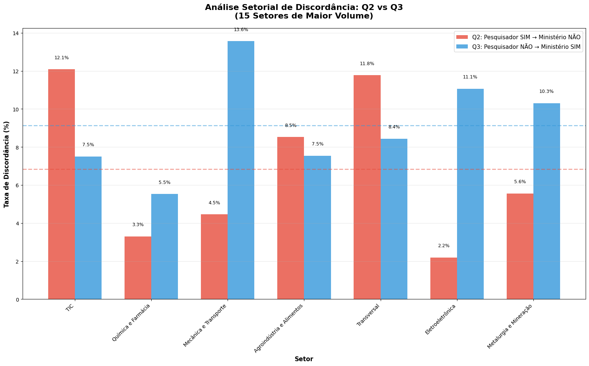

    📈 ANÁLISE DE PADRÕES SETORIAIS:
    --------------------------------------------------------------------------------

#### Tabelas 6.3 e 6.4 - Viés do Ministério e do Pesquisador

Estas tabelas identificam setores onde há um viés significativo
(diferença maior que 5%) entre Q2 e Q3. A tabela de viés do ministério
mostra setores onde Q2 \> Q3 + 5%, indicando que o ministério tende a
ser mais rigoroso nesses setores. A tabela de viés do pesquisador mostra
o oposto (Q3 \> Q2 + 5%). Cada tabela apresenta as taxas de Q2 e Q3, a
diferença entre elas (Δ) e o total de projetos. A coluna de diferença é
destacada com cor de fundo correspondente ao tipo de viés (rosa para
ministério, azul para pesquisador).

    🔵 Setores onde o PESQUISADOR é mais RIGOROSO (Q3 > Q2 + 5%):

<table id="T_173e7" data-quarto-postprocess="true">
<thead>
<tr>
<th class="blank level0" data-quarto-table-cell-role="th"> </th>
<th id="T_173e7_level0_col0" class="col_heading level0 col0"
data-quarto-table-cell-role="th">Setor</th>
<th id="T_173e7_level0_col1" class="col_heading level0 col1"
data-quarto-table-cell-role="th">Q3 (%)</th>
<th id="T_173e7_level0_col2" class="col_heading level0 col2"
data-quarto-table-cell-role="th">Q2 (%)</th>
<th id="T_173e7_level0_col3" class="col_heading level0 col3"
data-quarto-table-cell-role="th">Δ (Q3-Q2)</th>
<th id="T_173e7_level0_col4" class="col_heading level0 col4"
data-quarto-table-cell-role="th">Total</th>
</tr>
</thead>
<tbody>
<tr>
<td id="T_173e7_level0_row0" class="row_heading level0 row0"
data-quarto-table-cell-role="th">1</td>
<td id="T_173e7_row0_col0" class="data row0 col0">Mecânica e
Transporte</td>
<td id="T_173e7_row0_col1" class="data row0 col1">13.6%</td>
<td id="T_173e7_row0_col2" class="data row0 col2">4.5%</td>
<td id="T_173e7_row0_col3" class="data row0 col3">+9.1%</td>
<td id="T_173e7_row0_col4" class="data row0 col4">9068</td>
</tr>
<tr>
<td id="T_173e7_level0_row1" class="row_heading level0 row1"
data-quarto-table-cell-role="th">2</td>
<td id="T_173e7_row1_col0" class="data row1 col0">Eletroeletrônica</td>
<td id="T_173e7_row1_col1" class="data row1 col1">11.1%</td>
<td id="T_173e7_row1_col2" class="data row1 col2">2.2%</td>
<td id="T_173e7_row1_col3" class="data row1 col3">+8.9%</td>
<td id="T_173e7_row1_col4" class="data row1 col4">7158</td>
</tr>
</tbody>
</table>

    📊 RESUMO GERAL DE DISCORDÂNCIA POR SETOR:

                  
                  

#### Tabela 6.5 - Resumo Geral de Discordância por Setor

Esta tabela apresenta os 10 setores com maior taxa de discordância total
(Q2 + Q3). As colunas mostram o nome do setor, a taxa de discordância
total, as taxas individuais de Q2 e Q3, qual avaliador é mais rigoroso
naquele setor (colorido em rosa se for o ministério ou azul se for o
pesquisador), e o total de projetos. O setor TIC - Software lidera com
34,8% de discordância total. A coloração na coluna “Mais Rigoroso”
facilita a identificação visual de padrões de rigor por setor, mostrando
se há tendências sistemáticas em determinadas áreas.

<table id="T_adc24" data-quarto-postprocess="true">
<thead>
<tr>
<th class="blank level0" data-quarto-table-cell-role="th"> </th>
<th id="T_adc24_level0_col0" class="col_heading level0 col0"
data-quarto-table-cell-role="th">Setor</th>
<th id="T_adc24_level0_col1" class="col_heading level0 col1"
data-quarto-table-cell-role="th">Discord. Total</th>
<th id="T_adc24_level0_col2" class="col_heading level0 col2"
data-quarto-table-cell-role="th">Q2 (%)</th>
<th id="T_adc24_level0_col3" class="col_heading level0 col3"
data-quarto-table-cell-role="th">Q3 (%)</th>
<th id="T_adc24_level0_col4" class="col_heading level0 col4"
data-quarto-table-cell-role="th">Mais Rigoroso</th>
<th id="T_adc24_level0_col5" class="col_heading level0 col5"
data-quarto-table-cell-role="th">Total</th>
</tr>
</thead>
<tbody>
<tr>
<td id="T_adc24_level0_row0" class="row_heading level0 row0"
data-quarto-table-cell-role="th">1</td>
<td id="T_adc24_row0_col0" class="data row0 col0">Transversal</td>
<td id="T_adc24_row0_col1" class="data row0 col1">20.2%</td>
<td id="T_adc24_row0_col2" class="data row0 col2">11.8%</td>
<td id="T_adc24_row0_col3" class="data row0 col3">8.4%</td>
<td id="T_adc24_row0_col4" class="data row0 col4">Ministério</td>
<td id="T_adc24_row0_col5" class="data row0 col5">7467</td>
</tr>
<tr>
<td id="T_adc24_level0_row1" class="row_heading level0 row1"
data-quarto-table-cell-role="th">2</td>
<td id="T_adc24_row1_col0" class="data row1 col0">TIC</td>
<td id="T_adc24_row1_col1" class="data row1 col1">19.6%</td>
<td id="T_adc24_row1_col2" class="data row1 col2">12.1%</td>
<td id="T_adc24_row1_col3" class="data row1 col3">7.5%</td>
<td id="T_adc24_row1_col4" class="data row1 col4">Ministério</td>
<td id="T_adc24_row1_col5" class="data row1 col5">18772</td>
</tr>
<tr>
<td id="T_adc24_level0_row2" class="row_heading level0 row2"
data-quarto-table-cell-role="th">3</td>
<td id="T_adc24_row2_col0" class="data row2 col0">Mecânica e
Transporte</td>
<td id="T_adc24_row2_col1" class="data row2 col1">18.0%</td>
<td id="T_adc24_row2_col2" class="data row2 col2">4.5%</td>
<td id="T_adc24_row2_col3" class="data row2 col3">13.6%</td>
<td id="T_adc24_row2_col4" class="data row2 col4">Pesquisador</td>
<td id="T_adc24_row2_col5" class="data row2 col5">9068</td>
</tr>
<tr>
<td id="T_adc24_level0_row3" class="row_heading level0 row3"
data-quarto-table-cell-role="th">4</td>
<td id="T_adc24_row3_col0" class="data row3 col0">Agroindústria e
Alimentos</td>
<td id="T_adc24_row3_col1" class="data row3 col1">16.1%</td>
<td id="T_adc24_row3_col2" class="data row3 col2">8.5%</td>
<td id="T_adc24_row3_col3" class="data row3 col3">7.5%</td>
<td id="T_adc24_row3_col4" class="data row3 col4">Ministério</td>
<td id="T_adc24_row3_col5" class="data row3 col5">8144</td>
</tr>
<tr>
<td id="T_adc24_level0_row4" class="row_heading level0 row4"
data-quarto-table-cell-role="th">5</td>
<td id="T_adc24_row4_col0" class="data row4 col0">Metalurgia e
Mineração</td>
<td id="T_adc24_row4_col1" class="data row4 col1">15.9%</td>
<td id="T_adc24_row4_col2" class="data row4 col2">5.6%</td>
<td id="T_adc24_row4_col3" class="data row4 col3">10.3%</td>
<td id="T_adc24_row4_col4" class="data row4 col4">Pesquisador</td>
<td id="T_adc24_row4_col5" class="data row4 col5">4989</td>
</tr>
<tr>
<td id="T_adc24_level0_row5" class="row_heading level0 row5"
data-quarto-table-cell-role="th">6</td>
<td id="T_adc24_row5_col0" class="data row5 col0">Eletroeletrônica</td>
<td id="T_adc24_row5_col1" class="data row5 col1">13.3%</td>
<td id="T_adc24_row5_col2" class="data row5 col2">2.2%</td>
<td id="T_adc24_row5_col3" class="data row5 col3">11.1%</td>
<td id="T_adc24_row5_col4" class="data row5 col4">Pesquisador</td>
<td id="T_adc24_row5_col5" class="data row5 col5">7158</td>
</tr>
<tr>
<td id="T_adc24_level0_row6" class="row_heading level0 row6"
data-quarto-table-cell-role="th">7</td>
<td id="T_adc24_row6_col0" class="data row6 col0">Química e
Farmácia</td>
<td id="T_adc24_row6_col1" class="data row6 col1">8.8%</td>
<td id="T_adc24_row6_col2" class="data row6 col2">3.3%</td>
<td id="T_adc24_row6_col3" class="data row6 col3">5.5%</td>
<td id="T_adc24_row6_col4" class="data row6 col4">Pesquisador</td>
<td id="T_adc24_row6_col5" class="data row6 col5">12845</td>
</tr>
</tbody>
</table>

    🔍 2. ANÁLISE COMPARATIVA E INSIGHTS
    --------------------------------------------------------------------------------

    💡 RECOMENDAÇÕES PARA REDUÇÃO DA SUBJETIVIDADE
    ================================================================================

    1. **HARMONIZAÇÃO DE CRITÉRIOS POR SETOR:**
       - Desenvolver guias específicos para setores com alta discordância
       - Realizar workshops de alinhamento entre avaliadores por área temática

    2. **PADRONIZAÇÃO DE INTERPRETAÇÕES:**
       - Criar exemplos concretos do que constitui "inovação suficiente" por setor
       - Estabelecer métricas objetivas para avaliar "clareza metodológica"

    3. **SISTEMA DE DUPLA CHECAGEM:**
       - Implementar revisão obrigatória para projetos em setores de alta discordância
       - Criar comitês mistos (pesquisador + analista) para casos limítrofes

    4. **CAPACITAÇÃO CONTINUADA:**
       - Treinar analistas do Ministério em aspectos técnicos específicos
       - Sensibilizar pesquisadores sobre requisitos formais e de enquadramento

    5. **FEEDBACK ESTRUTURADO:**
       - Implementar sistema de justificativas estruturadas com campos obrigatórios
       - Criar base de conhecimento com decisões anteriores como referência
        

    💾 Análise setorial exportada para 'analise_discordancia_setorial_q2_q3.csv'
